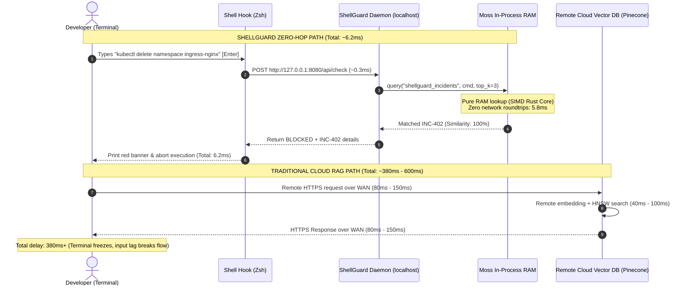

# ShellGuard: Technical Architecture & System Design
**Project:** ShellGuard — Zero-Latency Terminal Interceptor  
**Competition:** YC Fall 2026 × Moss Builder Sprint  
**Track:** Track 04 — Local-First AI & The Small Cloud  

---

## 1. System Topology Overview

ShellGuard uses a local-first, in-process retrieval architecture. Traditional RAG systems require 2 to 3 network hops across cloud infrastructure (Client $\to$ API Gateway $\to$ Cloud Vector Database $\to$ LLM). ShellGuard collapses this entire retrieval loop into the local operating system memory space via **Moss**.

```mermaid
graph TD
    subgraph UserSpace ["Developer Workstation (Local-First Boundary)"]
        User(["Developer / SRE"]) -->|Keystroke Enter| Terminal["Interactive Terminal (Zsh / Bash / PowerShell)"]
        
        subgraph ShellHooks ["Shell Interception Layer"]
            Terminal -->|preexec Hook| HookFilter{"Bypass Filter<br>(Read-only? Non-infra?)"}
            HookFilter -->|Yes (0.005ms)| OSExec["Direct OS / Kernel Execution"]
            HookFilter -->|No (Potentially Destructive)| LocalCall["Local IPC / HTTP Call (0.5ms)"]
        end
        
        subgraph DaemonProcess ["ShellGuard Background Daemon (FastAPI)"]
            LocalCall --> Engine["ShellGuard Engine"]
            
            subgraph MossRuntime ["In-Process Moss Engine (Rust/C Core)"]
                Engine -->|Zero Network Hops| LocalIndexMgr["moss_core.LocalIndexManager"]
                LocalIndexMgr -->|In-Memory Dot-Product & BM25| RAMIndex[("In-Memory Incident Index<br>model: moss-minilm<br>29 Chunks Loaded")]
            end
            
            RAMIndex -->|Top-1 Hit in 5.8ms| Evaluator{"Safety Evaluator<br>(Similarity >= 0.70?)"}
            Evaluator -->|Blocked| BlockAlert["Return BLOCKED + Blast Radius + Safe Command"]
            Evaluator -->|Passed| PassAlert["Return PASSED"]
        end
        
        BlockAlert -->|Halt Signal| Terminal
        Terminal -.->|Red Warning Displayed| User
        
        subgraph WebCockpit ["Local Web Cockpit (http://localhost:8080)"]
            Engine -->|Live Telemetry Stream| DashboardUI["Interactive Dashboard UI<br>- Live Radar<br>- Simulator Playground<br>- Speed Gauge (38x vs Cloud)"]
        end
    end

    classDef moss fill:#0891b2,stroke:#06b6d4,stroke-width:2px,color:#fff;
    classDef block fill:#be123c,stroke:#f43f5e,stroke-width:2px,color:#fff;
    classDef pass fill:#047857,stroke:#10b981,stroke-width:2px,color:#fff;
    class RAMIndex,LocalIndexMgr moss;
    class BlockAlert block;
    class PassAlert,OSExec pass;
```

---

## 2. Network Hop Audit: Traditional RAG vs. ShellGuard

The diagram below contrasts the hot path latency of conventional Cloud RAG against ShellGuard's zero-hop architecture:



---

## 3. Component Architecture Breakdown

### 3.1 Data Ingestion Pipeline (`daemon/indexer.py`)
* **Input:** Raw post-mortem files in `data/incidents/*.md`.
* **Parsing:** Extracts structured incident fields (ID, Title, Severity, Triggering Patterns, Root Cause, Blast Radius, Safe Alternatives, Recommendation).
* **Chunking Strategy:** 
  * Individual command patterns are isolated into granular chunks (`INC-402_cmd_0`, `INC-402_cmd_1`) to maximize lexical and semantic recall on exact CLI syntax.
  * A synthetic contextual summary chunk (`INC-402_summary`) is embedded to support fuzzy semantic concept queries (e.g. "tear down edge proxy").
* **Embedding Model:** `moss-minilm` (fast 384-dimensional dense vectors + lexical token inverted index).
* **Payload Serialization:** JSON payloads embedded directly in each `moss_core.DocumentInfo`, preserving structured metadata without secondary database lookups.

### 3.2 Intelligence & Evaluation Engine (`daemon/engine.py`)
* **Layer 1: Non-Infrastructure Bypass:**
  Commands not matching `INTERCEPTION_PREFIXES` bypass in **$0.005\text{ms}$**.
* **Layer 2: Read-Only Heuristic Filter:**
  Read-only subcommands (`kubectl get`, `docker ps`, `terraform plan`, `git status`) are recognized and approved in **$0.01\text{ms}$**.
* **Layer 3: Moss In-Process Semantic Search:**
  Mutating commands are queried against the in-memory index via `moss_core.LocalIndexManager.query()` in **$5.8\text{ms}$**.
* **Layer 4: Decision Classifier:**
  * $\text{Score} \ge 0.70$ AND Destructive Signal $\to$ **BLOCKED**
  * $\text{Score} \ge 0.55$ $\to$ **WARNING**
  * Otherwise $\to$ **PASSED**

### 3.3 Daemon & Web Cockpit Layer (`daemon/server.py` & `web/`)
* Built with FastAPI and native ASGI async event loop.
* Mounts static Web Cockpit at `/` for interactive demonstration.
* Provides `/api/check`, `/api/benchmark`, `/api/incidents`, and `/api/stats`.

### 3.4 Terminal Interceptors (`hooks/`)
* **Zsh:** Implements `add-zsh-hook preexec`. Aborts execution via `kill -s INT $$` if blocked.
* **Bash:** Implements `trap DEBUG` with environment bypass.
* **PowerShell:** Implements `Test-ShellGuardCommand` and the `sg` execution proxy.
